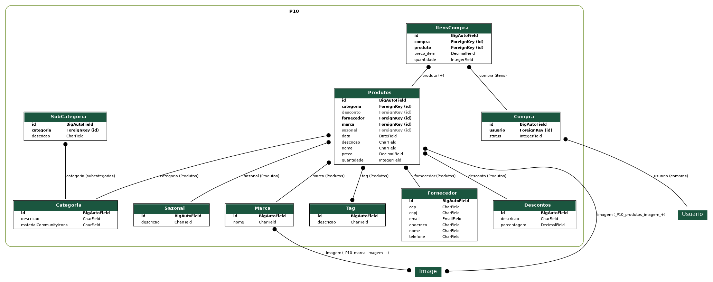

  
  
  
  
  
  
  

  <a href="https://github.com/horodeski/HumildeTentativaDeFazerUmPortfolio">
    <!-- logo se tiver 
    
-->
  </a>

  <h1 align="center">LOJAS P10!</h1>

  

    
Projeto desenvolvido para a matéria de Projeto Integrador em 2023

    <a href="https://github.com/MarceloHarbs/P10Documentacao"><strong>Documentação »</strong></a>
    <a href="https://github.com/horodeski/P10FrontEnd"><strong>FrontEnd »</strong></a>
    <a href="https://github.com/horodeski/P10Mobile"><strong>Mobile »</strong></a>
    <a href="https://github.com/eugreg/P10BackEnd"><strong>BackEnd »</strong></a>
    <a href="https://github.com/horodeski/P10Administracao"><strong>Administração »</strong></a>
  

## Equipe

* [Geovana Sophia Horodeski](https://github.com/horodeski) - geovana.horodeski06@gmail.com 
 
* [Gregory Ribeiro](https://github.com/eugreg) - daiaegregory@gmail.com
  
* [Marcelo Harbs](https://github.com/MarceloHarbs) - mharbs614@gmail.com 

</ul>

## Professores

* [Alann Perini](https://github.com/AlannKPerini) - alann.perini@ifc.edu.br
  
* [Marco André Mendes Lopes](https://github.com/marrcandre) - marco.mendes@ifc.edu.br

  
Sumário

  <ol>
    <li>
      <a href="#lojas-p10">Sobre o projeto</a>
      <ul>
        <li><a href="#situação-problema">Situação problema</a></li>
        <li><a href="#proposta">Proposta</a></li>
        <li><a href="#regras-de-negócio">Regras de negócio</a></li>
        <li><a href="#requisitos-funcionais">Requisitos funcionais</a></li>
        <li><a href="#requisitos-não-funcionais">Requisitos não funcionais</a></li>
      </ul>
    </li>
    <li>
     <a href="#contato">Contato</a>
     <ul>
        <li><a href="#equipe">Equipe</a></li>
        <li><a href="#professores">Professores</a></li>
     </ul>
   </li>
  </ol>

## Lojas P10

 
Fundada pelo Dr. Eduardo da Silva, as lojas P10 oferecem uma ampla variedade de produtos, desde itens de decoração e acessórios até utensílios domésticos e presentes criativos. Com preços acessíveis e produtos de qualidade, as lojas P10 rapidamente conquistaram o coração dos clientes que buscavam pechinchas, sem abrir mão da qualidade. Um destino popular para quem deseja encontrar ótimas ofertas e fazer compras econômicas.

## Situação Problema

O Dr. Eduardo notou que, com o aumento nas vendas e da popularidade da loja, os funcionários estavam tendo dificuldade para manter as informações sobre o estoque atualizadas.

Com esse aumento exponencial de compradores, o Dr. Eduardo reconheceu a necessidade de ter um sistema de controle de caixa e estoque. Os funcionários relataram dificuldades em acompanhar a entrada e saída de produtos do estoque, assim deixando as informações relacionadas aos produtos e vendas desatualizadas. Isso gerou gastos desnecessários e a perda de vendas, por causa da indisponibilidade de produtos, excesso de produtos com baixa demanda e ausência de produtos com alta demanda. 

Em segundo plano, o Dr. Eduardo quer aumentar a visibilidade e acesso à loja, criando uma loja online. Na loja online,  os usuários poderão cadastrar-se, efetuar consultas de preço e compras. O software auxiliaria a manter o estoque atualizado, evitando que hajam futuros problemas relacionados com a quantidade de produtos no estoque. Isso seria realizado através de um relatório mostrando a demanda e quantidade de produtos em estoque em tempo real para todos os funcionários que possuem acesso ao sistema.

## Proposta

O software visa melhorias no gerenciamento de estoque, facilitando as futuras consultas (quantidade de produto no estoque, preço do produto, etc.), acesso a relatórios referentes às vendas, deixando de maneira prática e ágil a atualização do estoque. 

Além de buscar facilitar o manuseio do estoque, o sistema terá uma interface voltada para compras online. Nessa interface voltada para vendas, o visitante/cliente poderá navegar livremente pelo sistema, visualizar produtos e adicioná-los no carrinho, porém, somente clientes cadastrados poderão efetuar a compra. O pagamento da compra poderá ser feito através de 4 formas: boleto bancário, cartão de crédito, cartão de débito e PIX.

O sistema terá 3 níveis de usuário: Cliente, Estoque e Gerente.

- **Cliente** - Terá acesso somente à interface de vendas (completa), podendo efetuar suas possíveis compras, navegar pelo sistema, visualizar produtos e postar avaliações sobre o produto.

- **Estoque** - Terá acesso somente à interface voltada para consulta e atualização do estoque. Poderá atualizar o sistema numa futura entrada de produtos e consultar preço, quantidade, descrição, fornecedor (qualquer informação referente ao produto).

- **Gerente** - Herdará as funcionalidades do usuário tipo Estoque e terá acesso aos relatórios de vendas e comprovantes fiscais. O usuário tipo Gerente será o único usuário que poderá cadastrar novos produtos e editá-los(alterar o preço do produto, nome, etc.).

## Regras de negócio

- **RN001 - Gerente:** Somente os usuários tipo Gerente terão acesso aos relatórios de vendas que serão fornecidos pelo sistema.

- **RN002 - Visitante:** Visitantes da interface de compras poderão navegar pelo sistema, visualizar produtos e adicioná-los ao carrinho, porém, não poderão efetuar a compra nem postar avaliações sobre o produto. 

- **RN003 - Cliente:** Os clientes cadastrados, além de poderem navegar pelo sistema, visualizar produtos e adicioná-los ao carrinho, poderão efetuar compras e postar avaliações sobre o produto. 

- **RN004 - Informações sobre o produto:**  O sistema deve fornecer as informações relacionadas ao pedido do cliente (preço, quantidade, data de entrega ou retirada).
- 
- **RN005 - Formas de pagamento:** O sistema deve fornecer para a loja online 4 formas de pagamento: Boleto bancário, cartão de crédito, cartão de débito e PIX.

- **RN006 - Confirmação de pagamento:** A compra somente será efetivada após a confirmação do pagamento, assim podendo dar continuidade ao processo de embalagem e envio ou retirada do(s) produto(s).

- **RN007 - Política de trocas:** A troca somente será aceita com recibo fiscal no prazo de 20 dias.

- **RN008 - Ofertas:** O sistema deve ter uma área destinada às promoções e ofertas da loja.

- **RN009 - Visto Recentemente:** O sistema deve mostrar as últimas consultas de produtos realizadas pelo cliente.

## Requisitos funcionais

**Entradas:**

- **R.F. 01 - Cadastro de usuários:** O sistema terá uma interface onde ocorrerá o cadastro de novos clientes.
  - **Dados necessários:** Nome completo, CPF, número de telefone, RG, e-mail, senha e login.
  - **Usuários:** todos os níveis de usuário.

- **R.F. 02 - Cadastro de produtos:** O sistema deve permitir o controle do estoque da loja, possibilitando o registro de novos produtos, atualização e exclusão de produtos.
  - **Dados necessários:** Código, nome do produto, fornecedor, descrição, categoria, quantidade no estoque e valor.
  - **Usuários:** Usuário tipo Gerente.

- **R.F. 03 - Cadastro de categorias:** O sistema deve permitir a criação de categorias, visando facilitar a navegabilidade entre os produtos.
  - **Dados necessários:** Nome da categoria e descrição da categoria.
  - **Usuários:** Usuário tipo Gerente.

- **R.F. 04 - Cadastro de fornecedor:** O sistema deve permitir o cadastro de fornecedores de produtos.
  - **Dados necessários:** Código, nome do fornecedor, descrição, email, telefone.
  - **usuários:** Usuário tipo Gerente.

**Processamento**
- **R.F. 05 - Autenticação de usuário:** Tem como funcionalidade autenticar o acesso ao sistema, verificando se o usuário pode acessá-lo. Caso possa, o usuário é direcionado para a página principal de seu perfil de acesso.
  - **Dados necessários:** Login, senha, nível de permissão. 
  - **Usuários:** Todos os níveis de usuário.

- **R.F. 06 - Entrada de produto:** O usuário tipo Estoque e Gerente terão acesso a está função que permitirá a atualização da quantidade de uma determinada mercadoria.
  - **Dados necessários:** código, quantidade.
  - **Usuários:** Usuário tipo Estoque e Gerente 

- **R.F. 07 - Adicionar produto ao carrinho:** O sistema permitirá que o usuário Cliente adicione produtos em seu carrinho de compra.
  - **Dados necessários:** informações do produto(Código, quantidade, etc) e do cliente(Login, nome, etc).
  - **Usuários:** Usuário tipo Cliente.

- **R.F. 08 - Confirmação de expedição:** Tem como finalidade confirmar o pagamento e autorizar a embalagem e envio/retirada do(s) produto(s) comprado(s). 
  - **Dados necessários:** Informações sobre a compra (Código da compra, código do cliente) e comprovante fiscal.
  - **Usuários:** Todos os níveis de usuário.

**Saídas:**

- **R.F. 09 - Relatório de vendas:** Entregará ao usuário tipo Gerente um tabela(relatório) informando quantos produtos foram vendidos, o valor total arrecadado com as vendas, quantidade de vendas feitas na loja física/virtual e taxa de crescimento de vendas. Essas informações serão fornecidas por produto e ao final no geral.
  - **Dados necessários:** Período (data inicial e final).
  - **Usuários:** Usuário tipo Gerente.
  
- **R.F. 10 - Relatório de produto:** Entregará ao usuário tipo Gerente um tabela(relatório) informando quais são os produtos que estão acabando. Em que, os produtos que possuem 70 ou menos no estoque estarão vermelho, produtos com mais de 70, menor ou igual a 200 em amarelo e produtos com mais de 200 em verde.
  - **Dados necessários:** Período (data inicial e final).
  - **Usuários:** Usuário tipo Gerente.

- **R.F. 11 - Pesquisa de produto:** O sistema deve permitir que o usuário filtre/pesquise entre as produtos.
  - **Dados necessários:** Nome do produto ou categoria.
  - **Usuários:** Todos os níveis de usuário.

## Requisitos não funcionais

- **R.N.F. 01 - Atuação:** O sistema deve ser capaz de lidar com o número necessário de usuários sem queda brusca de desempenho.

- **R.N.F. 02 - Responsividade/Usabilidade:** O sistema deve ser responsivo, sendo possível sua utilização em diversos dispositivos com alteração mínima.

- **R.N.F. 03 - Manutenção:** O sistema deve ser de fácil manutenção e atualização.

- **R.N.F. 04 - Segurança:** O sistema deve ser protegido contra acesso não autorizado.

- **R.N.F. 05 - Níveis de segurança:** O software terá diferentes tipos de acesso para cada tipo de login, tendo as permissões ideais a função de cada um.

- **R.N.F. 06 - Tecnologia Front-end web:** Para a exibição o sistema web será desenvolvido no framework VUEJS, HTML5 e CSS3.

- **R.N.F. 07 - Tecnologia Front-end mobile:** Para a exibição, o sistema mobile será desenvolvido no framework React-Native.

- **R.N.F. 08- Tecnologia Back-end:** O software será desenvolvido em Python, utilizando o framework Django, com a API REST utilizando o Django REST Framework.

- **R.N.F. 09 - Interoperabilidade:** O banco de dados será o MySQL.

- **R.N.F. 10 - Confiabilidade:** O sistema deve ser confiável e atender às necessidades do usuário.

- **R.N.F. 11 - Legais:** O sistema deve atender às exigências da LGPD (Leis Gerais da Proteção de Dados).

- **R.N.F. 12 - Disponibilidade:** O sistema deve atualizar em tempo real as informações do estoque, permitindo aos três níveis usuários visualizar a disponibilidade de produtos.

- **R.N.F. 13 - Acesso restrito:** O sistema deve permitir a configuração de perfis de acesso restrito para os funcionários, garantindo que apenas pessoas autorizadas possam realizar alterações no estoque e no caixa.

- **R.N.F. 14 - Facilidade de uso:** O sistema deve ser intuitivo e de fácil utilização pelos funcionários da loja, minimizando a necessidade de treinamento adicional.

- **R.N.F. 15 - Suporte técnico:** O sistema deve contar com suporte técnico para solucionar eventuais problemas que possam ocorrer no uso do software.

- **R.N.F. 16 - Backup:** O sistema deve fazer backup regularmente para garantir a segurança dos dados do sistema.

## Modelo entidade relacionamento 
